# National Digital Platform for Research, Policy Innovation, and Evidence-Based Land Governance
## Official Problem Statement (SIH 26019) & Complete Technical Specification

---

## 📌 Problem Statement Metadata

| Attribute | Official Specification |
| :--- | :--- |
| **Problem Statement ID** | SIH 26019 |
| **Title** | National Digital Platform for Research, Policy Innovation, and Evidence-Based Land Governance |
| **Ministry / Organization** | Ministry of Rural Development |
| **Department / Division** | Department of Land Resources (DoLR), PME Division |
| **Category** | Software |
| **Theme / Sub-theme** | Digital Knowledge Management, Artificial Intelligence, Geospatial Technologies & Evidence-Based Policy Innovation for Land Governance |

---

## 1. Background

Land is a finite and strategic resource that underpins economic development, environmental sustainability, food security, urban expansion, and social equity. Effective land governance is therefore critical to achieving sustainable development goals (SDGs) and supporting India's rapidly evolving socio-economic landscape. 

However, the land administration ecosystem in India remains largely implementation-oriented, with limited institutional focus on applied research, policy experimentation, and evidence-based innovation. While vast amounts of data are routinely generated across cadastral surveys, registration systems, satellite imagery, and government schemes, there is a lack of a unified digital intelligence ecosystem capable of synthesizing this data into actionable policy intelligence and research insights.

---

## 2. Description & High-Level Objective

Develop a comprehensive **National Digital Platform for Research and Policy Innovation** that promotes applied research, policy experimentation, knowledge sharing, and evidence-based decision-making in land governance.

The platform functions as a **centralized repository and collaborative ecosystem** that integrates:
- Datasets & cadastral records
- Research publications & academic white papers
- Policy documents, acts & gazette notifications
- Geospatial information & multi-epoch satellite feeds
- Analytical decision-support tools
- Case studies from various government departments, academic institutions, and research organizations.

---

## 3. Core Problems & Emerging Challenges

Emerging challenges require continuous research and innovative policy interventions. Despite the availability of vast datasets generated through land records, cadastral surveys, satellite imagery, GIS platforms, and government programmes, these resources remain underutilized for generating actionable insights and supporting informed policymaking.

### Key Problem Areas:
1. **Climate Change & Environmental Stress**: Vulnerability of agricultural and coastal lands to degradation, floods, droughts, and sea-level rise.
2. **Rapid Urbanization & Land Transitions**: Unplanned urban-rural fringe expansion, conversion of prime agricultural land, and zoning conflicts.
3. **Increasing Land Disputes & Judicial Backlog**: Overburdened civil and revenue courts with title disputes, boundary discrepancies, and tenure insecurity.
4. **Sustainable Land Use Planning**: Lack of multi-criteria spatial optimization models balancing ecological preservation, industrial growth, and food security.
5. **Geospatial Governance & Fragmentation**: Non-standardized spatial datasets across state and national jurisdictions.
6. **Digital Divide in Policy Research**: Absence of a unified platform connecting grassroots land administration data with top-tier research institutions and policy think tanks.

---

## 4. Scope of the Study (6 Core Research & Operational Dimensions)

There is a pressing need for a dedicated digital platform that serves as a national knowledge ecosystem for researchers, policymakers, government agencies, academic institutions, and industry experts to collaborate, conduct research, evaluate policies, and develop innovative solutions for strengthening land governance across the country.

| # | Scope Dimension | Focus Area | Key Objectives & Scope | Key Stakeholders |
| :-: | :--- | :--- | :--- | :--- |
| **1** | **Existing Research Ecosystem** | Institutional Knowledge Landscape | Study the current landscape of land administration research, policy development, and institutional knowledge management in India. | DoLR, NITI Aayog, Academic Think Tanks |
| **2** | **Multi-Stakeholder Collaboration** | Collaborative Network | Build an interconnected ecosystem bringing together researchers, administrators, and domain specialists. | Ministry of Rural Development, State Governments, Academic Institutions, Research Organizations, Think Tanks, Policy Makers, Survey Agencies, GIS Experts, NGOs, and International Organizations. |
| **3** | **Data Analytics** | Evidence-Based Analytics | Utilize AI, Machine Learning, and statistical tools to analyze land administration data and generate evidence-based insights for policy formulation. | Data Scientists, Econometricians, Policy Analysts |
| **4** | **Geospatial Integration** | Spatial Intelligence & Earth Observation | Integrate GIS, remote sensing, satellite imagery, and spatial analytics for land use planning, climate resilience, and infrastructure development. | ISRO / NRSC, Survey of India, Urban Planning Bodies, Forest Depts |
| **5** | **Dashboard & Reporting** | Executive Decision Cockpits | Provide interactive dashboards, visualization tools, policy indicators, research metrics, and customized reports for administrators and researchers. | District Magistrates, Tehsildars, Ministry Leadership, General Public |
| **6** | **Innovation & Challenges** | Open Innovation & Research Grants | Support hackathons, innovation challenges, pilot projects, and research initiatives to encourage innovative solutions for land governance. | Startups, Universities (IITs/IIMs), Students, Innovators |

---

## 5. Expected Solution (12 Core Platform Deliverables)

The proposed solution should be a **secure, scalable, AI-enabled National Research and Policy Innovation Platform** that strengthens evidence-based land governance through collaborative research, advanced analytics, and digital knowledge management.

The platform provides:

1. **Centralized Digital Repository**: Single-window archive for land governance research, policy papers, datasets, legal documents, cadastral survey data, and case studies.
2. **AI-Powered Search & Recommendation Engine**: NLP and vector semantic discovery engine for instant citation extraction, policy discovery, and cross-referencing.
3. **Collaborative Workspaces**: Virtual research labs, shared computational notebooks, and team workspaces for researchers, policymakers, academic institutions, and government agencies.
4. **Interactive GIS-Based Visualization**: High-resolution spatial mapping of land use patterns, climate vulnerability, infrastructure development, and policy impacts.
5. **Advanced Analytics & Decision-Support Tools**: Econometric and statistical modeling tools for evaluating policy effectiveness and identifying emerging trends.
6. **Policy Simulation Modules ("What-If" Sandbox)**: Scenario modeling engine to assess the likely socio-economic and tenurial outcomes of proposed reforms before implementation.
7. **Multi-Source Data Ingestion & Integration**: Seamless integration of satellite imagery, remote sensing feeds, land records (DILRMP/SVAMITVA), socio-economic datasets, and geospatial databases.
8. **AI-Assisted Research Tools**: Automated trend analysis, literature synthesis, generative policy briefing generators, and predictive modeling.
9. **National Innovation Portal**: Hackathon management system, research grants lifecycle tracking, pilot project sandboxes, and knowledge competitions.
10. **7-in-1 Interactive Dashboards**: Comprehensive real-time monitoring displaying:
    - Research outputs and citations
    - Policy performance indicators (KPIs)
    - Land use trends and transitions
    - Climate resilience metrics
    - Land dispute statistics and court pendency
    - Project implementation outcomes
    - Geospatial insights and cadastral coverage
11. **Secure Role-Based Access Control (RBAC)**: Fine-grained, zero-trust permissions for researchers, government officials, institutions, and public users with appropriate permissions.
12. **APIs & Interoperability Gateway**: Open standard APIs (REST, GraphQL, OGC) for seamless integration with existing government platforms (Bhunaksha, PM GatiShakti, API Setu), research databases, and GIS systems.

---

## 6. Official & Recommended Technology Stack

| Component / Layer | Suggested Technologies (Official & Extended) | Standards & Frameworks | Key Capabilities |
| :--- | :--- | :--- | :--- |
| **Frontend & Visualization** | Next.js 15, React 19, Tailwind CSS, Shadcn UI, Recharts, Framer Motion | HTML5, WCAG 2.1 AA | Ultra-responsive, accessible dashboards with smooth micro-interactions. |
| **Geospatial & Mapping** | Leaflet, MapLibre GL JS, GeoServer, GDAL, Rasterio, Deck.gl | OGC (WMS, WFS, GeoJSON, MVT) | Cadastral boundary overlays, satellite heatmaps, sub-meter parcel zooming. |
| **Backend & Microservices** | Python 3.12+, FastAPI, Uvicorn, Celery, Redis | OpenAPI 3.0, REST, OAuth2 | High-throughput async API endpoints and background task processing. |
| **AI, RAG & Search Engine** | LangChain / LlamaIndex, Sentence-BERT, Qdrant / Milvus / pgvector, Ollama | Vector Embeddings (1536-d), RAG | Legal & policy question-answering with verifiable citations and OCR parsing. |
| **Policy Simulation Engine** | Python (NumPy, SciPy, Pandas, Statsmodels), Mesa (Agent-Based Modeling) | JSON Schema, Discrete Simulation | Predictive "what-if" policy scenario modeling and econometric projections. |
| **Database & Knowledge Store** | PostgreSQL + PostGIS, MongoDB, Neo4j, Elasticsearch | ACID, Spatial SQL, Cypher | Spatial cadastral queries, entity relationship graph, full-text search. |
| **Cloud & Deployment** | NIC Cloud (MeghRaj), AWS / Azure Government Cloud, Docker, Kubernetes | Cloud Native, MeitY Empaneled | High availability, sovereign data hosting, automated horizontal scaling. |
| **Collaboration & Innovation** | Knowledge Portal, Discussion Forums, Workflow Management, Grant Trackers | RBAC, Audit Trails | Shared research rooms, hackathon pipelines, grant milestone management. |

---

## 7. High-Level System Architecture

```mermaid
flowchart TD
    subgraph DataSources["Data Ingestion & External Sources"]
        D1["Cadastral & Land Records\n(DILRMP / SVAMITVA / Bhunaksha)"]
        D2["Satellite Imagery & GIS\n(ISRO Bhuvan / Sentinel / Landsat)"]
        D3["Policy & Legal Documents\n(Gazettes, Revenue Laws, eCourts Case Laws)"]
        D4["Socio-Economic & Climate Data\n(Census, SECC, IMD, Soil Health)"]
    end

    subgraph Ingestion["ETL & Ingestion Pipelines"]
        ETL["Apache Airflow / GDAL / Rasterio / OCR Parser\nData Standardization & Canonical Land Model"]
    end

    subgraph StorageEngine["Storage & Multi-Model Database Layer"]
        DB1[("PostgreSQL + PostGIS\nSpatial & Tabular Records")]
        DB2[("Neo4j Graph Database\nDisputes & Entity Relationships")]
        DB3[("Qdrant / pgvector\nSemantic Embeddings & Index")]
        DB4[("Object Store (S3 / MinIO)\nRaw Datasets, Rasters & PDFs")]
    end

    subgraph CoreEngine["Core Intelligence & Compute Engines"]
        AI["AI / NLP Engine (RAG, Summarization, Legal Precedents)"]
        SIM["Policy Simulation & Scenario Sandbox (Mesa / SimPy)"]
        GIS["Geospatial Processing Engine (GeoServer / PyGIS)"]
    end

    subgraph APIGateway["API & Security Layer"]
        SEC["OAuth2 / OIDC Authentication & Strict RBAC"]
        GW["API Gateway (FastAPI / OGC Compliant WMS/WFS)"]
    end

    subgraph PresentationLayer["Presentation & Application Layer"]
        UI1["National Overview & DILRMP Dashboard"]
        UI2["GIS Cadastral Studio & Climate Overlays"]
        UI3["Interactive Land Knowledge Graph (Neo4j)"]
        UI4["AI Policy Synthesizer & Legal RAG"]
        UI5["Policy 'What-If' Simulation Sandbox"]
        UI6["Gazette & Research Archive"]
        UI7["Innovation & Hackathon Portal"]
        UI8["Citizen Voice & WhatsApp Bhu-Seva Bot"]
    end

    subgraph Stakeholders["Target Users & Beneficiaries"]
        U1["Ministry of Rural Development & DoLR"]
        U2["State Revenue Departments & District Magistrates"]
        U3["Academic Researchers & Think Tanks"]
        U4["Judiciary & Revenue Courts"]
        U5["Citizens & Rural Landholders"]
    end

    DataSources --> ETL
    ETL --> StorageEngine
    StorageEngine <--> CoreEngine
    CoreEngine <--> GW
    GW <--> SEC
    GW --> PresentationLayer
    PresentationLayer --> Stakeholders
```

---

## 8. Summary of Expected National Impact

* **Evidence-Based Policymaking**: Shift from intuitive reforms to data-backed, simulated policy actions.
* **Enhanced Land Tenure Security**: Accelerated dispute resolution through geospatial clarity and judicial analytics.
* **Climate Resilient Land Use**: Science-guided land zoning protecting vulnerable agro-ecological systems.
* **Interdisciplinary Collaboration**: Democratized access to land datasets for universities, startups, and global researchers.
* **Transparent & Future-Ready Governance**: Standardized national metrics supporting India's sustainable growth and Viksit Bharat 2047 vision.
