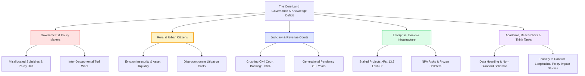
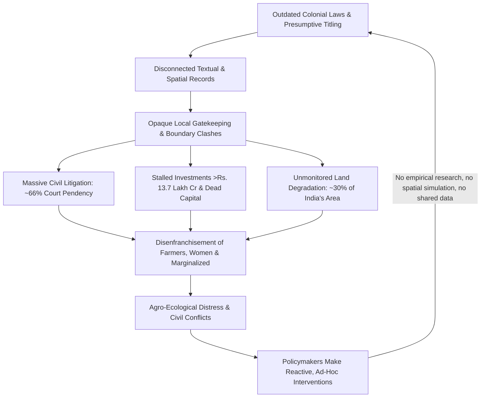

# Deep Research Report: The Land Governance Crisis & Policy Research Divide in India
## Comprehensive Problem Anatomy, Multi-Stakeholder Impact Analysis & Systemic Vulnerabilities

---

### Executive Summary of the Problem

Land is the fundamental spatial anchor of India’s socio-economic existence, food security, industrialization, and ecological stability. However, India's land governance architecture operates in a state of chronic institutional, legal, spatial, and epistemological fragmentation. 

The core crisis is two-fold:
1. **The Ground Reality Crisis**: A century of layered administrative regimes operating under **presumptive titling**, outdated colonial frameworks, decoupled spatial-textual records, and uncoordinated state-level jurisdictions. This creates pervasive land tenure insecurity, explosive civil litigation, stalled capital investments, violent land conflicts, ecological exploitation, and marginalization of vulnerable populations.
2. **The Policy-Research Disconnect**: While administrative departments generate vast streams of operational data (cadastral maps, registration volumes, mutation dockets) and scientific bodies generate petabytes of earth observation data (satellite imagery, flood plains, soil degradation indices), **these data assets remain locked in operational silos**. Policymakers craft multi-billion-rupee schemes without empirical or spatial simulation; academic researchers lack access to granular, standardized ground truth; and judiciary courts adjudicate in complete blindness to real-time administrative status.

---

## 1. Historical & Legal Genesis of the Problem

### 1.1 The Presumptive Titling Trap
* **The Registration Act of 1908 vs. Title Guarantee**: Under Indian law, registration of a land deed merely records the *transaction* (a deed of transfer), not the *authenticity of the title itself*. The state guarantees no ownership rights; it merely registers that person A purported to sell land to person B on a stamp paper.
* **Caveat Emptor ("Buyer Beware")**: The entire legal burden of verifying 30-to-50-year encumbrances, succession disputes, and revenue clearances falls on the citizen or buyer.
* **Separation of Deed Registration & Revenue Mutation**: The Department of Stamps and Registration (which registers the deed) and the Revenue Department (which maintains the Record of Rights / Jamabandi / Patta) historically operate as completely detached agencies. A sale deed registered on day one may take years—or never—be reflected in the mutation register, leaving a perpetual gap for fraud and multi-selling.

### 1.2 Constitutional and Jurisdictional Fragmentation
* **Seventh Schedule Dichotomy**: Under Entry 18 of the State List (List II) of the Constitution of India, *Land* (rights in or over land, land tenures, collection of rents, transfer and alienation of agricultural land) is an exclusive **State Subject**.
* **Divergent State Revenue Codes**: Over 30 states and union territories maintain mutually incompatible Land Revenue Codes, tenancy regulations, land ceiling limits, inheritance norms, terminology (e.g., *Khasra, Khatauni, Jamabandi, Adangal, 7/12, RoR, Chitta, Poramboke, Gair Mumkin Khad*), and classification systems.
* **National Policy Impasse**: While the Union Government (Ministry of Rural Development / DoLR) can formulate national programs and allocate funding (such as DILRMP or SVAMITVA), it lacks constitutional authority to enforce legislative uniformity, conclusive titling regimes, or standardized spatial-data mandates across states.

---

## 2. The Data & Geospatial Rupture: The Six Critical Gaps

```
+-----------------------------------------------------------------------------------+
|                           THE SIX CRITICAL DOMAIN GAPS                            |
+-----------------------------------------------------------------------------------+
| 1. Textual vs. Spatial Decoupling  | Text records don't match map boundaries       |
| 2. Static Records vs. Dynamic Land | Physical ground reality changes unrecorded   |
| 3. Abadi & Commons Vacuum          | Village habitations & common lands unmapped  |
| 4. Jurisdictional Siloing          | Revenue, Registration, Forests don't sync    |
| 5. Earth Observation Isolation     | Satellite monitoring never reaches tehsils   |
| 6. Upstream Policy Blindness       | Central policy made without empirical models |
+-----------------------------------------------------------------------------------+
```

### 2.1 The Spatial-Textual Decoupling
* In millions of parcels across India, the textual attribute (*Khatiyan* / Jamabandi) stating that a farmer owns 1.5 acres has **no mathematically verified polygon** on the cadastral map (*Bhu-naksha*).
* Boundaries are defined by narrative descriptions (e.g., "bounded by the stream on the north, Ram's plot on the west"), many dating back to British-era chain-and-compass surveys conducted in the 1920s–1950s.
* When manual cadastral maps were digitized (scanned and vectorized), topological errors (overlapping polygons, sliver polygons, unclosed traverses, scale distortions) were permanently codified into the digital layer.

### 2.2 The "Abadi" (Inhabited Rural Land) Vacuum
* Until the recent advent of drone mapping surveys, rural residential areas (*Gaon Than* / *Lal Dora* / *Abadi*) were historically left unmeasured by revenue authorities because colonial administrations were solely interested in collecting agricultural revenue.
* As a consequence, hundreds of millions of rural households possess zero formal documentary title for their ancestral dwellings, rendering them legally invisible, non-bankable, and vulnerable to eviction.

### 2.3 Common Lands & "No Man's Land" Tragedy
* Common Property Resources (CPRs)—village pastures (*Gauchar*), water bodies (*Talabs*, wetlands), community forests, and catchment areas—are either undocumented, under-classified, or designated as vaguely defined wasteland (*Banjad* / *Gair Mumkin*).
* Because these lands have no specific private claimant, they become the easiest targets for illegal encroachment, sand mining, real estate reclamation, and unmitigated state diversion.

### 2.4 Earth Observation & Satellite Data Isolation
* Space agencies (ISRO / NRSC) generate satellite imagery capturing land use/land cover (LULC), soil erosion, surface water fluctuations, and desertification.
* However, this Earth Observation (EO) data operates on multi-spectral raster formats at national or regional scales, completely disconnected from village-level vector cadastral boundaries used by the *Patwari* (village accountant).
* A tehsil officer has no programmatic way of knowing that a parcel marked as "irrigated double-crop" in revenue records has been submerged, degraded into scrubland, or illegally converted into an industrial warehouse.

---

## 3. Comprehensive Stakeholder Ecosystem & Pain Points

The problem ripples across an expansive and deeply interconnected network of stakeholders. Every stakeholder group suffers from specific structural vulnerabilities, financial hemorrhaging, or administrative deadlocks:



### 3.1 Citizens & Landholders
#### A. Small and Marginal Farmers (Owning < 2 Hectares, 86% of Indian Farmers)
* **Informal Fragmentation**: Land is divided generation after generation among heirs without legal partition (*Batwara*). On official paper, the deceased grandfather remains the recorded owner; the five grandsons farming distinct sub-plots cannot obtain Kisan Credit Cards (KCC), crop insurance (PMFBY), or direct benefit transfers (PM-KISAN) without the bribe or approval of local revenue clerks.
* **Predatory Encroachment**: Boundary blurring makes smallholder plots vulnerable to land grabs by powerful local elites.
* **Distress Distress Dispossession**: Lack of clear title leaves them prey to exploitative middlemen during compulsory land acquisition.

#### B. Women Landholders & Inheritance Disenfranchisement
* Despite the Hindu Succession (Amendment) Act 2005 giving equal coparcenary rights to daughters, local land records rarely reflect women's names.
* Revenue records routinely bypass widows or daughters during mutation, requiring prolonged family contestation. Less than 14% of operational landholdings in India are owned by women, despite women performing over 60% of agricultural labor.

#### C. Tribal & Forest Dwelling Communities (Adivasis)
* **Historical Injustice and Tenurial Precarity**: Colonial forest reservations classified ancestral tribal lands as State Forests. 
* Implementation of the Forest Rights Act (FRA) 2006 is crippled by conflicting maps between the Forest Department and Revenue Department. Millions of individual and community forest rights claims remain rejected or unmapped without spatial validation.
* **Mining and Industrial Displacement**: Tribes face involuntary resettlement without adequate compensation because their customary, collective rights are not registered as individual titles.

#### D. Peri-Urban & Urban Slum Dwellers
* Rural-urban transitional zones lack clear municipal classification. Citizens buying unregularized plots (*Khasra* plots in illegal colonies) live under the perpetual threat of demolition and cannot access basic civic services (water, electricity, sewerage connections) due to disputed land tenure.

---

### 3.2 The Judiciary & Revenue Courts
* **The Two-Thirds (66%) Litigation Avalanche**: According to the landmark DAKSH Access to Justice survey and NITI Aayog research, **approximately 66% of all civil litigation in India is land- or property-related**.
* **Decades-Long Dispute Lifecycles**: A single title or boundary case takes an average of **20 years** to traverse the revenue courts (Tehsildar -> Sub-Divisional Magistrate -> Additional Collector -> Revenue Board) and subsequent civil court tiers (District Court -> High Court -> Supreme Court).
* **Judicial Information Blindness**: Judges adjudicate property cases relying on paper affidavits, outdated certified copies, and contradictory commissioner reports, with zero access to dynamic, tamper-evident spatial or revenue telemetry.
* **Violent Crimes**: Over 10% of violent crimes and homicides in rural India have their direct genesis in boundary disputes, path-of-access conflicts, and partition feuds.

---

### 3.3 Government Administrators & Policymakers
#### A. Grassroots Revenue Machinery (Patwaris, Lekhpals, Tehsildars)
* **Human Monopoly & Rent-Seeking**: The *Patwari* acts as the single, opaque gatekeeper of village truth. Citizens are subject to arbitrary discretion for mutations, caste certificates, income certificates, and boundary verifications.
* **Extensive Workload & Analog Drift**: Revenue personnel are overwhelmed with disaster relief, election duties, and census surveys, leaving field books (*Khasra Girdawari*) unupdated for years.

#### B. District & State Administrators (District Collectors, Revenue Secretaries)
* **Administrative Silos**: Revenue, Registration, Municipal Corporations, Town Planning, Forest, Irrigation, and Highway authorities work in strict isolation. 
* **Inter-Departmental Disputes**: Government departments frequently sue each other in court over land ownership (e.g., Railways vs. Municipalities, Forest Department vs. Revenue Department).

#### C. Union Ministries (Rural Development, Agriculture, Environment, Urban Affairs)
* **Policy Blindness**: National policies on land degradation, rural housing, industrial corridors, and agricultural subsidies are formulated using aggregated, outdated national statistics rather than ground-level empirical reality.
* **Inability to Simulate Impact**: Ministries cannot predict how an amendment to tenancy laws or compensation multipliers will impact tenant farmers versus absentee landlords before rolling out the legislation.

---

### 3.4 Economic, Banking & Enterprise Ecosystem
#### A. Infrastructure Developers & Industrial Projects
* **Stalled Capital**: Data from *Land Conflict Watch* documents that over **700+ ongoing land conflicts embroil more than Rs. 13.7 Lakh Crore ($165+ Billion USD)** in stalled public and private infrastructure and industrial investments.
* Over **2.1 million hectares** of project land are contested, directly affecting more than **6.5 million citizens**.
* Complex land acquisition procedures under the RFCTLARR Act 2013 frequently stall national highway projects, railway freight corridors, solar parks, and airport developments for 5 to 15 years.

#### B. Banking & Formal Credit Sector
* **Frozen Collateral**: Banks cannot safely underwrite mortgage loans on agricultural or peri-urban land because the title cannot be guaranteed.
* **Fraudulent Multiple Mortgages**: Due to unlinked registration and revenue databases, fraudulent borrowers frequently take multiple loans from different banks using the same physical parcel by submitting counterfeit or non-updated title deeds, leading to systemic Non-Performing Assets (NPAs).

---

### 3.5 Academic, Research & Think Tank Ecosystem
* **Data Asymmetry & Hoarding**: Research institutions (such as IITs, IIMs, NALSAR, CPR, IGIDR, NIPFP) cannot access un-redacted, longitudinal land records or spatial datasets due to bureaucratic barricades and lack of open data protocols.
* **Fragmented Research**: Academic research on land economics, urban transitions, and agrarian distress remains isolated in disparate PDFs, theoretical journals, and regional studies, never synthesizing into high-level policy frameworks.
* **Absence of Multi-Disciplinary Synthesis**: Economists, legal scholars, geospatial scientists, and hydrologists operate in disciplinary silos, leaving policymakers without cross-domain, evidence-backed recommendations.

---

## 4. Systemic Dimensions: What All is Affected?

```
+-----------------------------------------------------------------------------------------+
|                              SYSTEMIC IMPACT DIMENSIONS                                 |
+-----------------------------------------------------------------------------------------+
| ECONOMIC & CAPITAL   | • ~1.3% GDP loss annually due to land litigation and delays.      |
|                      | • >Rs. 13.7 Lakh Crore locked in 700+ contested projects.       |
|                      | • Inability of farmers to monetize asset wealth (~$4-5 Trillion).|
+----------------------+------------------------------------------------------------------+
| AGRARIAN & RURAL     | • Sub-optimal land tenancy markets (land left fallow in fear).   |
|                      | • Inability to access institutional credit; reliance on usury.   |
|                      | • Crop insurance leakages due to unrecorded tenant farmers.       |
+----------------------+------------------------------------------------------------------+
| ECOLOGICAL & CLIMATE | • 29.77% (97.85M ha) of India's geographical area is degrading.  |
|                      | • Unchecked encroachment of wetlands, floodplains, and forests.  |
|                      | • Climate disasters (floods, landslides) hitting unmapped slums. |
+----------------------+------------------------------------------------------------------+
| URBAN & PERI-URBAN   | • Uncontrolled sprawl eating up fertile agricultural fringes.    |
|                      | • Speculative land cartels, black money storage, artificial costs|
|                      | • Slums unable to receive in-situ redevelopment due to titles.   |
+----------------------+------------------------------------------------------------------+
| JUDICIAL & GOVERNANCE| • ~66% of all civil litigation clogging Indian courts.           |
|                      | • 20+ year dispute lifecycles draining generational family wealth|
|                      | • Deterioration of citizen trust in the state's sovereign record |
+-----------------------------------------------------------------------------------------+
```

### 4.1 Macroeconomic & Financial Paralyzation
* **Dead Capital**: De Soto’s concept of "dead capital" manifests acutely in India. Indian citizens hold an estimated **$4 to $5 Trillion** worth of land assets, but a massive fraction cannot be pledged, sold transparently, or developed due to defective titles and legal uncertainty.
* **GDP Growth Depressant**: Studies by McKinsey, the World Bank, and Indian economic researchers estimate that land dispute delays and insecure property rights shave off **1.0% to 1.3% from India's annual GDP growth rate**.
* **Black Money & Tax Evasion**: Discrepancies between official government circle rates (*Guidance Values*) and true market values drive massive cash-based under-invoicing in land transactions, starving state exchequers of stamp duty revenue.

### 4.2 Agrarian Distress & Tenancy Lock-in
* **The Fallow Land Irony**: India has millions of hectares of agricultural land left deliberately fallow or under-utilized because absentee landowners fear that leasing the land to tenant farmers will lead to adverse possession or illegal tenancy claims under ambiguous land-to-the-tiller laws.
* **Disenfranchisement of Tenant Farmers**: Pure tenant farmers (sharecroppers / *bataidars*), who cultivate roughly 20–30% of agricultural land in several states, have no written contracts. Consequently, when climate shocks occur (droughts, unseasonal hailstorms), government disaster compensation goes directly to the absentee landlord's bank account, while the ruined cultivator receives zero relief.

### 4.3 Ecological Collapse & Climate Vulnerability
* **Accelerating Land Degradation**: According to the Space Applications Centre (ISRO) *Desertification and Land Degradation Atlas of India*, **29.77% (97.85 million hectares)** of India's Total Geographical Area (TGA) underwent land degradation in 2018–19 (up from 28.76% in 2003–05).
* **Destruction of Natural Buffers**: Because cadastral maps do not interface with ecological boundaries, wetlands, mangrove swamps, and river floodplains are routinely rezoned, sold, or built over. When extreme weather strikes, the loss of these unmonitored ecosystems triggers urban catastrophic flooding (e.g., Chennai, Bengaluru, Mumbai).
* **Climate Displacement**: Farmers displaced by soil salinity intrusion or persistent drought cannot migrate or transition livelihoods easily because their degraded land cannot be sold or mortgaged.

### 4.4 Urban Sprawl & Peri-Urban Chaos
* **The "Grey Zone" of the Rural-Urban Fringe**: Rapid economic growth pushes cities into surrounding rural village panchayats. These areas exist in a planning twilight zone—too rural for the municipal authority, too urban for the village panchayat.
* **Speculative Land Speculation**: Real estate mafias exploit fragmented village records, buying agricultural land under power of attorney, creating unapproved sub-divisions, and selling to middle-class citizens who later discover their homes violate zoning laws or sit on government *poramboke* land.

---

## 5. Root Causes: Why Has Previous Digitization Not Solved the Problem?

Despite decades of the **Digital India Land Records Modernization Programme (DILRMP)** and over 99% computerization of Record of Rights (RoRs) across many states, the problem remains acute:

```
+------------------------------------------------------------------------------------------+
|                  THE FOUR FATAL ASSUMPTIONS OF LEGACY DIGITIZATION                       |
+------------------------------------------------------------------------------------------+
| 1. "Digitizing Bad Records Makes Them Good" -> Scanning flawed paper documents merely    |
|    digitized historical errors, boundary disputes, and colonial inaccuracies.            |
|                                                                                          |
| 2. "Textual Records Equal Spatial Reality"  -> Storing names in a database without       |
|    reconciling ground parcel polygons left physical boundaries completely contested.      |
|                                                                                          |
| 3. "Data Generation Equals Policy Evidence" -> Generating millions of revenue entries    |
|    without analytical, cross-departmental, or simulation tools leaves leaders blind.     |
|                                                                                          |
| 4. "Central Scheme Overcomes Federal Schism" -> Centralized funding without state legal |
|    amendments for conclusive titling hit a constitutional wall.                          |
+------------------------------------------------------------------------------------------+
```

1. **Digitizing Flawed Data**: Scanning and typing manual paper records into databases did not correct historical fraud, omissions, or boundary errors—it merely digitized them at scale, giving flawed records a false veneer of digital authenticity.
2. **Persistence of Presumptive Law**: Digitization did not alter the fundamental law. The state still does not guarantee title or indemnify citizens against administrative record errors.
3. **The Inter-Departmental Berlin Wall**: Revenue, Survey, Registration, Forest, and eCourts databases remain isolated. Mutation is still not uniformly automated with registration across every district.
4. **Lack of a Unified Research & Evidence Engine**: Government agencies view land records strictly through the lens of revenue collection and administrative routine. There has been **no national institutional apparatus** dedicated to analyzing land data for:
   * Empirical policy design
   * Early-warning conflict detection
   * Socio-economic simulation
   * Cross-jurisdictional best practice synthesis

---

## 6. Synthesis: The Vicious Problem Loop



### Conclusion of Problem Research
The challenge articulated under **SIH 26019** is not merely a technical file-storage issue or a departmental IT hurdle. It is a **foundational governance and knowledge-deficit crisis** that spans constitutional, legal, spatial, agrarian, macroeconomic, and ecological dimensions. 

By remaining divided between ground-level administrative silos, inaccessible academic ivory towers, and blind executive policymaking, the land governance problem continuously perpetuates generational litigation, stalls national wealth generation, destabilizes ecosystems, and deprives India's most vulnerable citizens of their constitutional right to secure livelihood and property.
